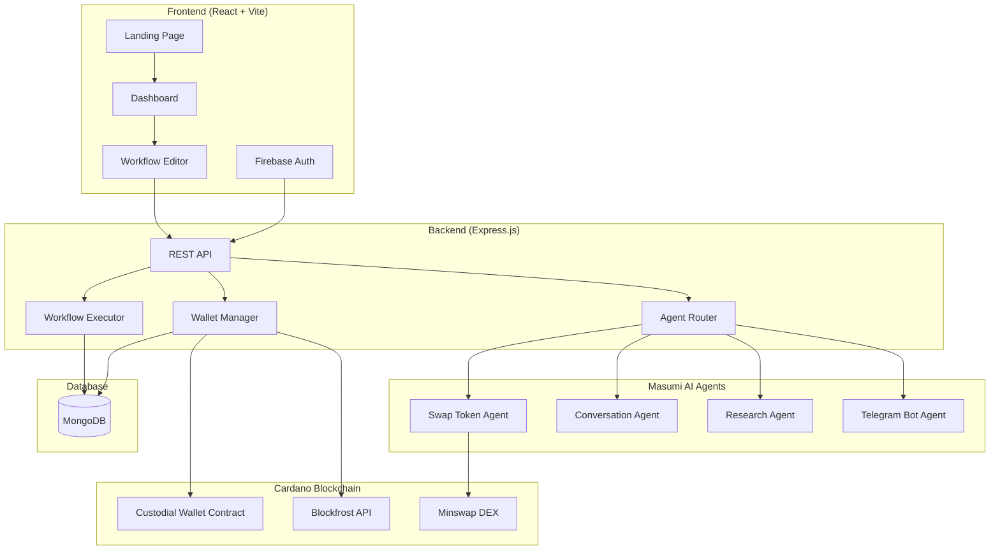
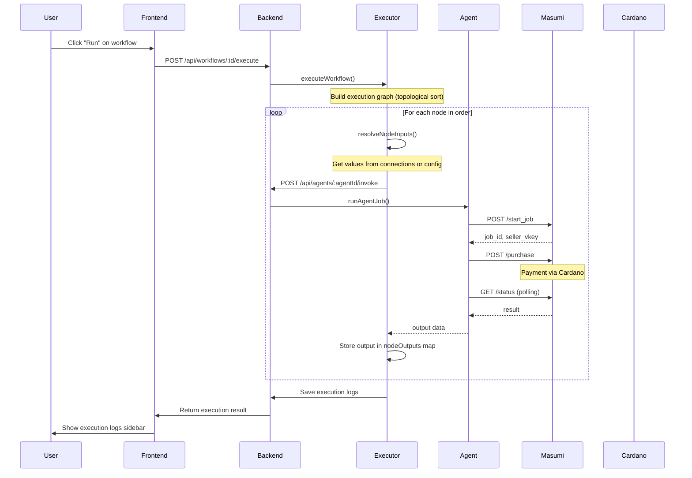

# 🌊 AdaFlow - AI Agent Workflow Orchestrator for Cardano

<div align="center">


**A no-code platform to build, deploy, and monetize AI agent workflows on Cardano**

[](https://reactjs.org/)
[](https://cardano.org/)
[](https://masumi.ai/)
[](https://aiken-lang.org/)

</div>

---

## 📖 Overview

AdaFlow is a visual workflow builder that enables users to create, chain, and deploy AI agent automations on the Cardano blockchain. Think Zapier/n8n, but for decentralized AI agents with on-chain payments via the Masumi Protocol.

### Key Features

- 🎨 **Visual Drag-and-Drop Editor** - Build complex workflows without code
- 🤖 **Pre-built AI Agents** - Swap tokens, research, chat, send notifications
- ⛓️ **Agent Chaining** - Connect agents to pass data between them
- 💰 **Custodial Wallet** - Smart contract-controlled funds for automated payments
- 📊 **Execution Logs** - Real-time monitoring and detailed execution history
- 🔐 **Firebase Auth** - Secure user authentication

---

## 🏗️ Architecture



---

## 🔄 Workflow Execution Flow



---

## 📂 Project Structure

```
cardano-hackathon/
├── frontend/                 # React + Vite + TypeScript
│   ├── src/
│   │   ├── components/
│   │   │   ├── AgentEditor/  # Workflow visual editor
│   │   │   │   ├── AgentEditor.tsx
│   │   │   │   ├── AgentNode.tsx
│   │   │   │   ├── TriggerNode.tsx
│   │   │   │   ├── AgentPalette.tsx
│   │   │   │   ├── NodeConfigSidebar.tsx
│   │   │   │   └── ExecutionLogsSidebar.tsx
│   │   │   └── ...
│   │   ├── pages/
│   │   │   ├── DashboardPage.tsx
│   │   │   ├── AgentEditorPage.tsx
│   │   │   └── LandingPage.tsx
│   │   ├── services/
│   │   │   └── api.ts         # API client
│   │   └── context/
│   │       ├── AuthContext.tsx
│   │       └── ToastContext.tsx
│   └── ...
│
├── backend/                   # Express.js + MongoDB
│   ├── routes/
│   │   ├── workflows.js       # CRUD + execution
│   │   ├── agents.js          # Agent invocation
│   │   ├── wallet.js          # Wallet management
│   │   ├── swap.js            # Minswap integration
│   │   └── auth.js            # Firebase auth
│   ├── services/
│   │   └── workflowExecutor.js # Core execution engine
│   ├── models/
│   │   ├── Workflow.js
│   │   └── User.js
│   └── middleware/
│       └── auth.js            # Firebase token validation
│
├── contracts/                 # Aiken smart contracts
│   └── adaflow/
│       └── validators/
│           └── custodial_wallet.ak
│
└── agents/                    # Custom agent implementations
```

---

## 🧠 Core Concepts

### 1. Workflow Execution Engine

The heart of AdaFlow is the **Workflow Executor** which handles agent chaining:

```javascript
// backend/services/workflowExecutor.js

// 1. Build execution order using topological sort (Kahn's algorithm)
const executionOrder = buildExecutionGraph(nodes, edges);

// 2. Track outputs from each node
const nodeOutputs = new Map();

// 3. Execute nodes in dependency order
for (const node of executionOrder) {
  // Resolve inputs from connections or manual config
  const inputs = resolveNodeInputs(node, edges, nodeOutputs);
  
  // Execute the agent
  const result = await executeAgentNode(node, inputs, context);
  
  // Store output for downstream nodes
  nodeOutputs.set(node.id, result.output);
}
```

### 2. Agent Input Resolution

Data flows between agents via **edges** that connect output handles to input handles:

```javascript
function resolveNodeInputs(node, edges, nodeOutputs) {
  const inputs = {};
  
  for (const param of node.data.inputParameters) {
    // Check if there's a connection providing this input
    const incomingEdge = edges.find(
      e => e.target === node.id && e.targetHandle === `input-${param.name}`
    );
    
    if (incomingEdge && nodeOutputs.has(incomingEdge.source)) {
      // Get value from connected node's output
      const sourceOutput = nodeOutputs.get(incomingEdge.source);
      const outputName = incomingEdge.sourceHandle.replace('output-', '');
      inputs[param.name] = sourceOutput[outputName];
    } else {
      // Use manually configured value
      inputs[param.name] = node.data.inputValues[param.name]?.value;
    }
  }
  
  return inputs;
}
```

### 3. Custodial Wallet Smart Contract

The **Aiken** smart contract enables secure agent-controlled spending:

```aiken
// contracts/adaflow/validators/custodial_wallet.ak

pub type WalletDatum {
  owner: VerificationKeyHash,           // User's public key hash
  approved_agents: List<VerificationKeyHash>,  // Authorized agent keys
}

pub type WalletRedeemer {
  Deposit                                // User adds funds
  AgentSpend                             // Agent spends (any amount)
  UserWithdraw                           // User withdraws
  AddAgent { agent: VerificationKeyHash }    // Authorize new agent
  RemoveAgent { agent: VerificationKeyHash } // Revoke agent access
}

// Agent spend only requires agent signature - no limits
AgentSpend -> {
  agent_has_signed(tx.extra_signatories, wallet_datum.approved_agents)
}
```

---

## 🤖 Available Agents

| Agent | Description | Input | Output |
|-------|-------------|-------|--------|
| **Swap Token Agent** | DEX swaps via Minswap | `fromToken`, `toToken`, `totalAmount` | `toTokenAmount` |
| **Conversation Agent** | AI chat/responses | `inputText` | `outputText` |
| **Research Agent** | Web research & summarization | `query` | `summary` |
| **Telegram Bot Agent** | Send Telegram notifications | `inputText` | `status` |

---

## 🚀 Getting Started

### Prerequisites

- Node.js >= 20.17
- MongoDB
- Firebase project (for authentication)
- Blockfrost API key (for Cardano)

### 1. Clone the repository

```bash
git clone https://github.com/AceVikings/cardano-hackathon.git
cd cardano-hackathon
```

### 2. Backend Setup

```bash
cd backend
npm install

# Create .env file
cat > .env << EOF
PORT=5001
MONGODB_URI=mongodb://localhost:27017/adaflow
BLOCKFROST_API_KEY=your_blockfrost_api_key
BLOCKFROST_URL=https://cardano-preprod.blockfrost.io/api
NETWORK=Preprod
EOF

# Start backend
npm run dev
```

### 3. Frontend Setup

```bash
cd frontend
npm install

# Create .env file with Firebase config
cat > .env << EOF
VITE_API_URL=http://localhost:5001/api
VITE_FIREBASE_API_KEY=your_firebase_api_key
VITE_FIREBASE_AUTH_DOMAIN=your_project.firebaseapp.com
VITE_FIREBASE_PROJECT_ID=your_project_id
EOF

# Start frontend
npm run dev
```

### 4. Open the app

Navigate to `http://localhost:5173` in your browser.

---

## 📡 API Endpoints

### Workflows

| Method | Endpoint | Description |
|--------|----------|-------------|
| `GET` | `/api/workflows` | List all user workflows |
| `GET` | `/api/workflows/:id` | Get workflow details |
| `POST` | `/api/workflows` | Create new workflow |
| `PUT` | `/api/workflows/:id` | Update workflow |
| `DELETE` | `/api/workflows/:id` | Delete workflow |
| `POST` | `/api/workflows/:id/execute` | Execute workflow |
| `GET` | `/api/workflows/executions/recent` | Get recent executions |

### Agents

| Method | Endpoint | Description |
|--------|----------|-------------|
| `GET` | `/api/available-agents` | List available agents |
| `POST` | `/api/agents/swap-token-agent/invoke` | Invoke swap agent |
| `POST` | `/api/agents/conversation-agent/invoke` | Invoke conversation agent |
| `POST` | `/api/agents/research-agent/invoke` | Invoke research agent |
| `POST` | `/api/agents/telegram-bot-agent/invoke` | Invoke telegram agent |

### Wallet

| Method | Endpoint | Description |
|--------|----------|-------------|
| `GET` | `/api/wallet` | Get/create developer wallet |
| `GET` | `/api/wallet/balance` | Get wallet balance |
| `GET` | `/api/wallet/status` | Get custodial wallet status |

---

## 🛠️ Development

### Running Tests

```bash
# Backend tests
cd backend && npm test

# Frontend type check
cd frontend && npx tsc --noEmit
```

### Building for Production

```bash
# Frontend build
cd frontend && npm run build

# Backend (use PM2 or similar)
cd backend && npm start
```

---

## 🔧 Tech Stack

| Layer | Technology |
|-------|------------|
| **Frontend** | React 18, Vite, TypeScript, TailwindCSS, React Flow, Framer Motion |
| **Backend** | Express.js, Node.js 20+, Mongoose |
| **Database** | MongoDB |
| **Auth** | Firebase Authentication |
| **Blockchain** | Cardano (Preprod), Lucid, Blockfrost |
| **Smart Contracts** | Aiken |
| **AI Agents** | Masumi Protocol |
| **DEX** | Minswap SDK |

---

## 🤝 Contributing

1. Fork the repository
2. Create your feature branch (`git checkout -b feature/amazing-feature`)
3. Commit your changes (`git commit -m 'Add amazing feature'`)
4. Push to the branch (`git push origin feature/amazing-feature`)
5. Open a Pull Request

---

## 📜 License

This project is licensed under the ISC License.

---

## 🙏 Acknowledgments

- [Masumi Protocol](https://masumi.ai/) - AI Agent payment infrastructure
- [Minswap](https://minswap.org/) - DEX integration
- [Aiken](https://aiken-lang.org/) - Smart contract language
- [Blockfrost](https://blockfrost.io/) - Cardano API provider

---

<div align="center">
  <p>Built with 💙 for the Cardano Hackathon 2025</p>
</div>
